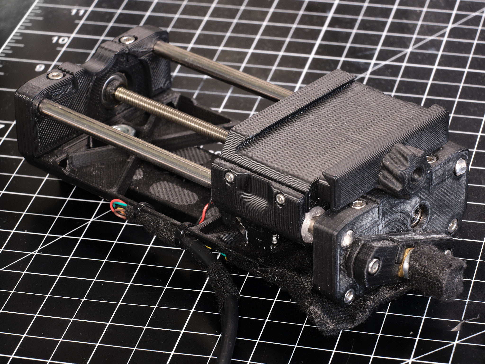
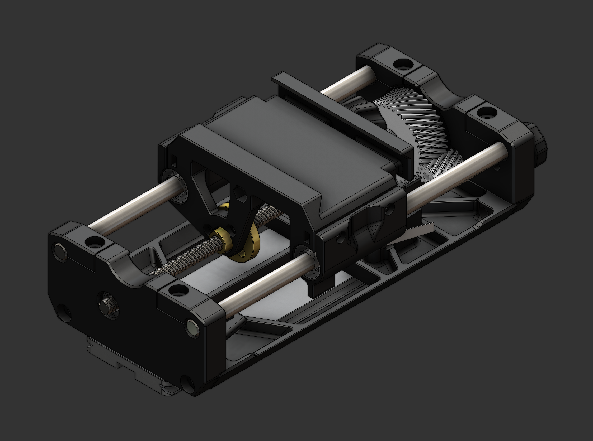
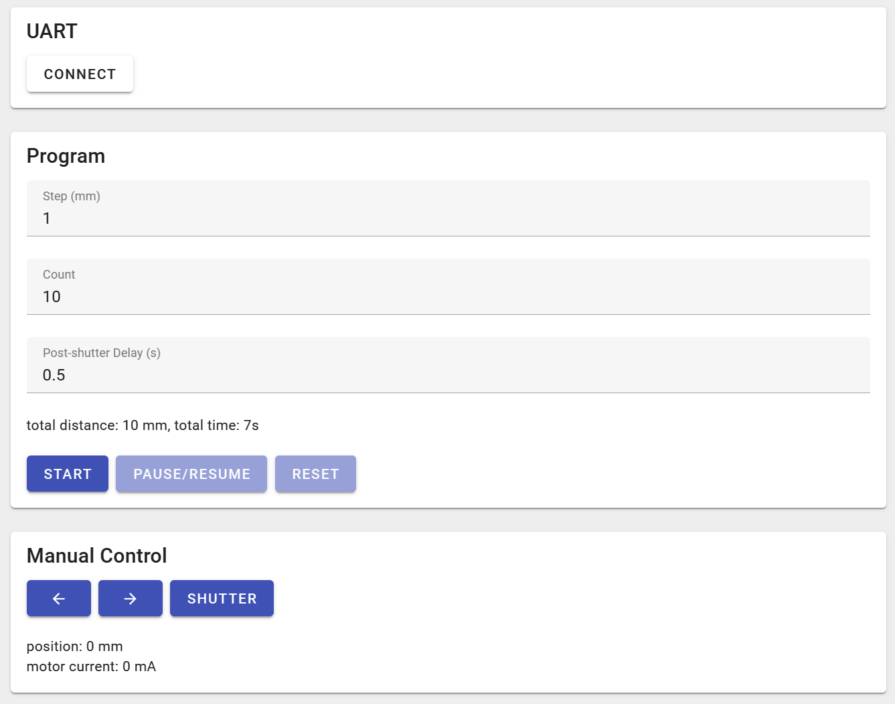

# macro rail
Mostly 3D printed camera slider for focus stacking macrophotography

## Summary
Low-cost, mostly 3D printed automated camera slider for focus stacking macrophotography.

## Parts List
### Hardware
* 150mm Arca-Swiss quick release plate\
I used [this Amazon listing](https://www.amazon.com/gp/product/B00I5I4PAA)
* 2x 150mm long, 6mm diameter steel linear shafts
* 150mm long T5x2mm leadscrew with nut\
I used [this Amazon listing](https://www.amazon.com/gp/product/B0969LMP1G)
* 2x 696 ball bearings
* 2x 1/4-20 hex nuts
* M3 socket head cap screws and heat-set threaded inserts
* M2 socket head cap screws and hex nuts

### Electronics
* N20-size gear motor, 200RPM\
I used [this eBay listing](https://www.ebay.com/itm/294544820576?var=593072744047)
* SS-3GLP or compatible microswitch
* Camera remote shutter release\
For cameras with the standard 2.5mm TRRS jack, this is as simple as a matching cable and a small N-channel MOSFET
* [Motor controller PCB](https://jackw01.github.io/ripplecounter/)

### Software

### License
All code provided is released under the MIT License.

The CAD files are licensed under a [Creative Commons Attribution-ShareAlike 4.0 International License](http://creativecommons.org/licenses/by-sa/4.0/).
